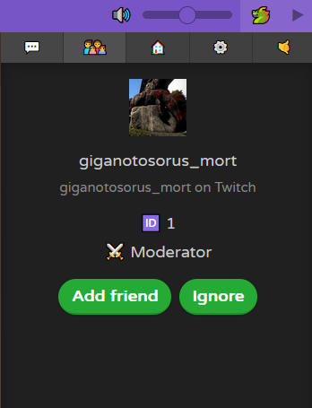
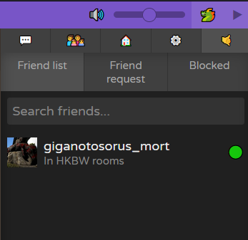

# GigaOverlay - JKLM.FUN

#### Setup the script in your browser
1. Download the [Tampermonkey](https://www.tampermonkey.net) extension
2. Add a new script, paste the content of `script.js` and save

### How to use the overlay
1. You have a settings button here

2. Use the friend system
    - The token system:

        If you want to keep your friends list on various computers, you need a token. This like a password and your account (twitch or discord) act as an identifier
        The first time you use it, you'll be asked asked to choose a token, so remember it if you want to retrieve your friends list by changing browser/computer.

    - How to use friends system:

        You can add friend when they have the overlay. To to that you just need to go on the user profile in the room players list
        
        After that everything is accessible via this button
        

**This overlay is more social-oriented than the others, so if you want it to be useful, recommend it to your friends !**

#### You can join my discord server for help or suggestions
[Discord](http://discord.gg/Dsh49abxF7)